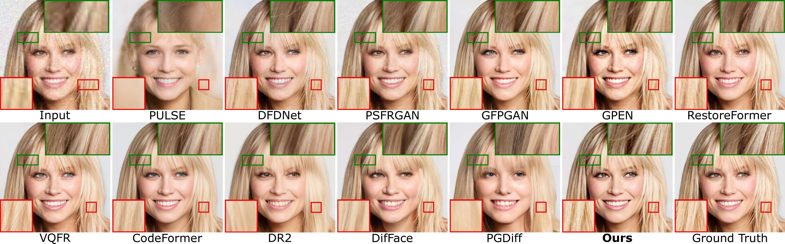

## InterLCM: Low-Quality Images as Intermediate States of Latent Consistency Models for Effective Blind Face Restoration

[Project Page](https://shangchenzhou.com/projects/CodeFormer/)

[](https://huggingface.co/spaces/sczhou/CodeFormer) 


[Senmao Li](https://sen-mao.github.io/)<sup>1,2*</sup>, [Kai Wang](https://wangkai930418.github.io/)<sup>2</sup>, [Joost van de Weijer](https://scholar.google.com/citations?user=Gsw2iUEAAAAJ&hl=en)<sup>2</sup>, [Fahad Shahbaz Khan](https://sites.google.com/view/fahadkhans/home)<sup>3,4</sup>, [Chun-Le Guo](https://mmcheng.net/clguo/)<sup>1</sup>, [Shiqi Yang](https://www.shiqiyang.xyz/)<sup>5</sup>, [Yaxing Wang](https://scholar.google.es/citations?user=6CsB8k0AAAAJ&hl=en)<sup>1</sup>, [jian Yang](https://scholar.google.com.hk/citations?user=6CIDtZQAAAAJ)<sup>1</sup>, [Ming-Ming Cheng](https://mmcheng.net/cmm/)<sup>1</sup>, [Chongyi Li](https://li-chongyi.github.io/)<sup>1</sup>   

1.Nankai University, 2.Computer Vision Center, Universitat Autònoma de Barcelona, 3.Mohamed bin Zayed University of AI, 4.Linkoping University, 5.Independent Researcher, Tokyo

*Work was done during a research stay at Computer Vision Center, Universitat Autònoma de Barcelona


:star: If InterLCM is helpful to your images or projects, please help star this repo. Thanks! :hugs: 


### Update
- **2024.12.24**: This repo is created.

#### Face Restoration (synthetic of CelebA-Test)



#### Face Restoration (real-world images from LFW-Test, WebPhoto-Test, and WIDER-Test)


[//]: # (#### Face Color Enhancement and Restoration)

[//]: # ()
[//]: # ( )

[//]: # ()
[//]: # (#### Face Inpainting)

[//]: # ()
[//]: # ( )


[//]: # ()
[//]: # (### Dependencies and Installation)

[//]: # ()
[//]: # (- Pytorch >= 1.7.1)

[//]: # (- CUDA >= 10.1)

[//]: # (- Other required packages in `requirements.txt`)

[//]: # (```)

[//]: # (# git clone this repository)

[//]: # (git clone https://github.com/sczhou/CodeFormer)

[//]: # (cd CodeFormer)

[//]: # ()
[//]: # (# create new anaconda env)

[//]: # (conda create -n codeformer python=3.8 -y)

[//]: # (conda activate codeformer)

[//]: # ()
[//]: # (# install python dependencies)

[//]: # (pip3 install -r requirements.txt)

[//]: # (python basicsr/setup.py develop)

[//]: # (conda install -c conda-forge dlib &#40;only for face detection or cropping with dlib&#41;)

[//]: # (```)

[//]: # (<!-- conda install -c conda-forge dlib -->)

[//]: # ()
[//]: # (### Quick Inference)

[//]: # ()
[//]: # (#### Download Pre-trained Models:)

[//]: # (Download the facelib and dlib pretrained models from [[Releases]&#40;https://github.com/sczhou/CodeFormer/releases/tag/v0.1.0&#41; | [Google Drive]&#40;https://drive.google.com/drive/folders/1b_3qwrzY_kTQh0-SnBoGBgOrJ_PLZSKm?usp=sharing&#41; | [OneDrive]&#40;https://entuedu-my.sharepoint.com/:f:/g/personal/s200094_e_ntu_edu_sg/EvDxR7FcAbZMp_MA9ouq7aQB8XTppMb3-T0uGZ_2anI2mg?e=DXsJFo&#41;] to the `weights/facelib` folder. You can manually download the pretrained models OR download by running the following command:)

[//]: # (```)

[//]: # (python scripts/download_pretrained_models.py facelib)

[//]: # (python scripts/download_pretrained_models.py dlib &#40;only for dlib face detector&#41;)

[//]: # (```)

[//]: # ()
[//]: # (Download the CodeFormer pretrained models from [[Releases]&#40;https://github.com/sczhou/CodeFormer/releases/tag/v0.1.0&#41; | [Google Drive]&#40;https://drive.google.com/drive/folders/1CNNByjHDFt0b95q54yMVp6Ifo5iuU6QS?usp=sharing&#41; | [OneDrive]&#40;https://entuedu-my.sharepoint.com/:f:/g/personal/s200094_e_ntu_edu_sg/EoKFj4wo8cdIn2-TY2IV6CYBhZ0pIG4kUOeHdPR_A5nlbg?e=AO8UN9&#41;] to the `weights/CodeFormer` folder. You can manually download the pretrained models OR download by running the following command:)

[//]: # (```)

[//]: # (python scripts/download_pretrained_models.py CodeFormer)

[//]: # (```)

[//]: # ()
[//]: # (#### Prepare Testing Data:)

[//]: # (You can put the testing images in the `inputs/TestWhole` folder. If you would like to test on cropped and aligned faces, you can put them in the `inputs/cropped_faces` folder. You can get the cropped and aligned faces by running the following command:)

[//]: # (```)

[//]: # (# you may need to install dlib via: conda install -c conda-forge dlib)

[//]: # (python scripts/crop_align_face.py -i [input folder] -o [output folder])

[//]: # (```)

[//]: # ()
[//]: # ()
[//]: # (#### Testing:)

[//]: # ([Note] If you want to compare CodeFormer in your paper, please run the following command indicating `--has_aligned` &#40;for cropped and aligned face&#41;, as the command for the whole image will involve a process of face-background fusion that may damage hair texture on the boundary, which leads to unfair comparison.)

[//]: # ()
[//]: # (Fidelity weight *w* lays in [0, 1]. Generally, smaller *w* tends to produce a higher-quality result, while larger *w* yields a higher-fidelity result. The results will be saved in the `results` folder.)

[//]: # ()
[//]: # ()
[//]: # (🧑🏻 Face Restoration &#40;cropped and aligned face&#41;)

[//]: # (```)

[//]: # (# For cropped and aligned faces &#40;512x512&#41;)

[//]: # (python inference_codeformer.py -w 0.5 --has_aligned --input_path [image folder]|[image path])

[//]: # (```)

[//]: # ()
[//]: # (:framed_picture: Whole Image Enhancement)

[//]: # (```)

[//]: # (# For whole image)

[//]: # (# Add '--bg_upsampler realesrgan' to enhance the background regions with Real-ESRGAN)

[//]: # (# Add '--face_upsample' to further upsample restorated face with Real-ESRGAN)

[//]: # (python inference_codeformer.py -w 0.7 --input_path [image folder]|[image path])

[//]: # (```)

[//]: # ()
[//]: # (:clapper: Video Enhancement)

[//]: # (```)

[//]: # (# For Windows/Mac users, please install ffmpeg first)

[//]: # (conda install -c conda-forge ffmpeg)

[//]: # (```)

[//]: # (```)

[//]: # (# For video clips)

[//]: # (# Video path should end with '.mp4'|'.mov'|'.avi')

[//]: # (python inference_codeformer.py --bg_upsampler realesrgan --face_upsample -w 1.0 --input_path [video path])

[//]: # (```)

[//]: # ()
[//]: # (🌈 Face Colorization &#40;cropped and aligned face&#41;)

[//]: # (```)

[//]: # (# For cropped and aligned faces &#40;512x512&#41;)

[//]: # (# Colorize black and white or faded photo)

[//]: # (python inference_colorization.py --input_path [image folder]|[image path])

[//]: # (```)

[//]: # ()
[//]: # (🎨 Face Inpainting &#40;cropped and aligned face&#41;)

[//]: # (```)

[//]: # (# For cropped and aligned faces &#40;512x512&#41;)

[//]: # (# Inputs could be masked by white brush using an image editing app &#40;e.g., Photoshop&#41; )

[//]: # (# &#40;check out the examples in inputs/masked_faces&#41;)

[//]: # (python inference_inpainting.py --input_path [image folder]|[image path])

[//]: # (```)

[//]: # ()
[//]: # (### Training:)

[//]: # (The training commands can be found in the documents: [English]&#40;docs/train.md&#41; **|** [简体中文]&#40;docs/train_CN.md&#41;.)

[//]: # (### Citation)

[//]: # (If our work is useful for your research, please consider citing:)


### License

Licensed under a [Creative Commons Attribution-NonCommercial 4.0 International](https://creativecommons.org/licenses/by-nc/4.0/) for Non-commercial use only.
Any commercial use should get formal permission first.

### Acknowledgement

This project is based on [LCM](https://github.com/luosiallen/latent-consistency-model) and [CodeFormer](https://github.com/sczhou/CodeFormer). Some codes are brought from [StableSR](https://github.com/IceClear/StableSR). Thanks for their awesome works.

### Contact
If you have any questions, please feel free to reach out to me at  `senmaonk@gmail.com`. 
