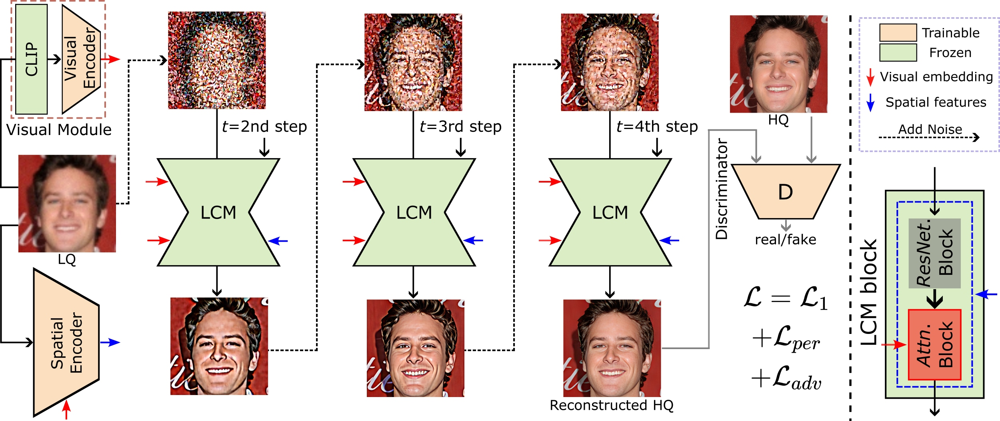

## InterLCM: Low-Quality Images as Intermediate States of Latent Consistency Models for Effective Blind Face Restoration

[Project Page](sen-mao.github.io/InterLCM-Page/)

[](https://huggingface.co/spaces/sczhou/CodeFormer) 


[Senmao Li](https://sen-mao.github.io/)<sup>1,2*</sup>, [Kai Wang](https://wangkai930418.github.io/)<sup>2</sup>, [Joost van de Weijer](https://scholar.google.com/citations?user=Gsw2iUEAAAAJ&hl=en)<sup>2</sup>, [Fahad Shahbaz Khan](https://sites.google.com/view/fahadkhans/home)<sup>3,4</sup>, [Chun-Le Guo](https://mmcheng.net/clguo/)<sup>1</sup>, [Shiqi Yang](https://www.shiqiyang.xyz/)<sup>5</sup>, [Yaxing Wang](https://scholar.google.es/citations?user=6CsB8k0AAAAJ&hl=en)<sup>1</sup>, [jian Yang](https://scholar.google.com.hk/citations?user=6CIDtZQAAAAJ)<sup>1</sup>, [Ming-Ming Cheng](https://mmcheng.net/cmm/)<sup>1</sup>, [Chongyi Li](https://li-chongyi.github.io/)<sup>1</sup>   

1.Nankai University, 2.Computer Vision Center, Universitat Autònoma de Barcelona, 3.Mohamed bin Zayed University of AI, 4.Linkoping University, 5.Independent Researcher, Tokyo

*Work was done during a research stay at Computer Vision Center, Universitat Autònoma de Barcelona




:star: If InterLCM is helpful to your images or projects, please help star this repo. Thanks! :hugs: 


### Update
- **2024.12.24**: This repo is created.

#### Face Restoration (synthetic of CelebA-Test)


#### Face Restoration (real-world images from LFW-Test, WebPhoto-Test, and WIDER-Test)


[//]: # (#### Face Color Enhancement and Restoration)

[//]: # ()
[//]: # ( )

[//]: # ()
[//]: # (#### Face Inpainting)

[//]: # ()
[//]: # ( )


### Dependencies and Installation

```
# git clone this repository
git clone https://github.com/sen-mao/InterLCM.git
cd InterLCM


# create new anaconda env
conda create -n interlcm python=3.8 -y
conda activate interlcm


# install python dependencies
pip3 install -r requirements.txt
python basicsr/setup.py develop
conda install -c conda-forge dlib (only for face detection or cropping with dlib)
```

<!-- conda install -c conda-forge dlib -->

### Testing:


#### 1. 🧑🏻 Face Restoration

```
# For cropped and aligned faces (512x512)
python inference_InterLCM.py --has_aligned --num_inference_steps 4 \
                             --input_path inputs/cropped_faces \
                             --output_path results/cropped_faces
```

#### 2. 🖼️ Whole Image Enhancement

```
# For whole image
# Add '--bg_upsampler realesrgan' to enhance the background regions with Real-ESRGAN
# Add '--face_upsample' to further upsample restorated face with Real-ESRGAN
python inference_InterLCM.py --num_inference_steps 4 \
                             --input_path inputs/whole_imgs \
                             --output_path results/whole_imgs \
                             --bg_upsampler realesrgan
```

---

### Training:

#### 1. 🧩 Preparing Dataset

- Download training dataset: [FFHQ](https://github.com/NVlabs/ffhq-dataset)
- Resize to 512 $\times$ 512 resolution

#### 2. 🚀 Training InterLCM

- Training Visual Encoder and Spatial Encoder:
  > python -m torch.distributed.launch --nproc_per_node=gpu_num --master_port=4323 basicsr/train.py -opt options/interlcm.yml --launcher pytorch
- Pre-trained Visual Encoder (`visual_encoder.pth`) and Spatial Encoder (`spatial_encoder.pth`) can be found in the folder of Releases v0.1.0: https://github.com/sen-mao/InterLCM/releases/tag/v0.1.0

---


### License

Licensed under a [Creative Commons Attribution-NonCommercial 4.0 International](https://creativecommons.org/licenses/by-nc/4.0/) for Non-commercial use only.
Any commercial use should get formal permission first.

### Acknowledgement

This project is based on [LCM](https://github.com/luosiallen/latent-consistency-model) and [CodeFormer](https://github.com/sczhou/CodeFormer). Some codes are brought from [StableSR](https://github.com/IceClear/StableSR). Thanks for their awesome works.

### Contact
If you have any questions, please feel free to reach out to me at  `senmaonk@gmail.com`. 
